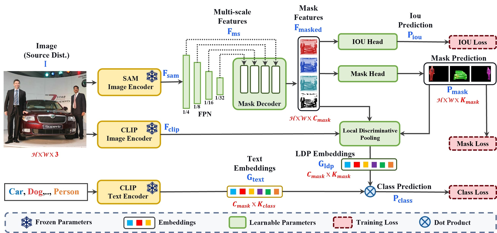

# PosSAM: Panoptic Open-vocabulary Segment Anything

 

[[`Project Page`](https://vibashan.github.io/possam-web/)] [[`arXiv`](https://arxiv.org/abs/2303.16891)] [[`PDF`]()] [[`Slides`]()]  [[`BibTeX`]()] 

  
</p

#### Contributions
- We introduce PosSAM, an open-vocabulary panoptic segmentation model that generates class and instance-aware masks with excellent generalization to a variety of visual concepts by unifying SAM and CLIP in an end-to-end trainable framework.
- We develop a novel Local Discriminative Pooling (LDP) module to enhance discriminative CLIP features with class-agnostic SAM features for an unbiased OV classification.
- We introduce the Mask-Aware Selective Ensembling algorithm to adaptively discern between seen and unseen classes by leveraging IoU and LDP confidence scores for each image.
- We conduct extensive experiments and demonstrate superior performance over existing state-of-the-art open-vocabulary panoptic segmentation methods across multiple benchmark datasets.

### Training
'Coming Soon...!!!'

### Inference
'Coming Soon...!!!'
